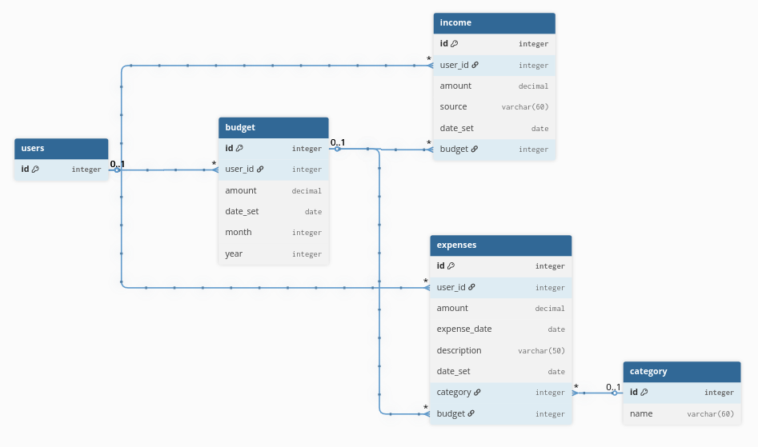
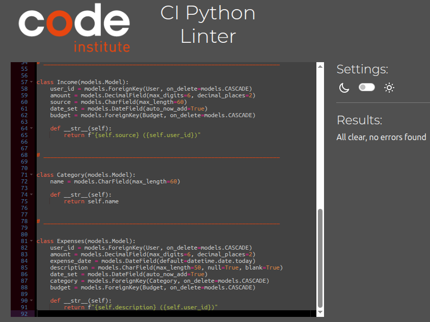

# MP_3_XpensoLog

## Contents

- [Project Introduction](#project-introduction)
- [Agile Methodology](#agile-methodology)
    - [Overview](#overview)
    - [MoSCoW Prioritisation Technique](#moscow-prioritisation-technique)
    - [GitHub Project Board](#github-project-board)
- [Website Goals & Objectives](#website-goals--objectives)
- [User Stories](#user-stories)
    - [Developer Stories](#developer-stories)
    - [Visitor Stories](#visitor-stories)
- [Epics](#epics)
- [Wireframes Design](#wireframes-design)
- [Database Design](#database-design)
- [Design Choices](#design-choices)
    - [Fonts](#fonts)
    - [Colour Scheme](#colour-scheme)
    - [Images](#images)
- [Security Measures](#security-measures)

## Project Introduction
XpensoLog is a user-friendly finance budgeting web application that enables users to create budgets, track income and log expenses by category. The app is designed to help users gain better control over their spending habits through clear, interactive features and data visualisation.

This project is being developed as part of Milestone Project 3 and aims to demonstrate my ability to implement full-stack web development concepts, with a strong focus on backend functionality using Python and the Django framework.

## Agile Methodology
### Overview
For this project, I plan to utilise the Agile methodology to promote flexibility and ensure steady progress towards a clear objective. Agile development is particularly effective in environments where requirements and ideas evolve throughout the development process. It enables teams to break down large tasks into manageable, iterative steps, fostering continuous improvement and adaptability. This approach allows for quick adjustments in response to changing needs, making it ideal for dynamic project environments.

### MoSCoW Prioritisation Technique
As part of the project planning process, I will apply the MoSCoW prioritisation technique to help determine the relative importance of features and tasks. This method categorises requirements into four distinct groups: Must Have, Should Have, Could Have, and Won’t Have (at this time). By clearly identifying what is essential versus what is optional or deferrable, this approach supports effective time and resource management, ensuring that critical elements are addressed early in the development cycle.

### GitHub Project Board
In line with Agile development methodology, I have made extensive use of GitHub’s project board by organising the development process into Epics, which are further broken down into user stories and manageable tasks. I have also utilised the Milestones feature, allowing me to group tasks into Sprint sections, each with a defined due date. By following this structured approach, I aim to maintain effective time management throughout the development of the web application, while also remaining adaptable to any necessary changes.

[Back to top](#contents)

## Website Goals & Objectives
- Empower Users to Manage Personal Finances:
    - Provide tools to help users set monthly budgets and track expenses effectively.
    - Enable categorisation of expenses for better insight into spending habits.

- Promote Financial Awareness and Accountability:
    - Offer clear visual summaries of income, outgoings, and remaining budget.
    - Help users identify areas where they can reduce costs or improve saving.

- Ensure an Intuitive and Accessible Experience:
    - Design a user-friendly interface that is simple, responsive, and accessible on all devices.
    - Minimise friction when inputting data and navigating between budgeting tools.

- Support Ongoing Improvement and Scalability:
    - Follow Agile development practices to iterate based on user feedback.
    - Build a scalable infrastructure capable of handling user growth and feature expansion.

- Prioritise Data Security and User Privacy:
    - Implement secure authentication to protect personal financial information.
    - Comply with data protection standards to ensure users’ privacy and trust.

- Encourage Continued Use and Habit Formation:
    - Provide reminders, insights, and positive feedback to help users stay engaged.
    - Allow users to view progress over time and set personal financial goals.

[Back to top](#contents)

--------------------------------------------------------------------------------------------
### User Stories
Through the implementation of Agile methodology, I created the user stories with the website’s goals and objectives in mind. The result is a well-organised structure of user stories, divided between developer-focused and visitor-focused perspectives. A full list of these is provided below.

#### Developer Stories
- [#9](https://github.com/CoalTrain1618/MP_3_Lets-Talk-Money/issues/9) As a Developer I want to implement an Agile work method so that I can develop a high quality we application that meets the needs of the user.
- [#10](https://github.com/CoalTrain1618/MP_3_Lets-Talk-Money/issues/10) As a Developer I want to design my database ERD to efficiently store and manage my web application content, ensuring optimal performance and flexibility.
- [#11](https://github.com/CoalTrain1618/MP_3_Lets-Talk-Money/issues/11) As a developer I want to ensure the web app is visually engaging and follows a mobile first responsive design so that Users can navigate the website and access relevant information with ease.
- [#12](https://github.com/CoalTrain1618/MP_3_Lets-Talk-Money/issues/12) As a developer I will create Wireframes so that I can Visually display my web application's design and structure.
- [#13](https://github.com/CoalTrain1618/MP_3_Lets-Talk-Money/issues/13) As a developer I will set up and configure the Django project so that I can create a secure working environment.
- [#18](https://github.com/CoalTrain1618/MP_3_Lets-Talk-Money/issues/18) As a developer, I want to define the requirements and create the initial Budget and Income models so that the data structure is ready for further development.
- [#19](https://github.com/CoalTrain1618/MP_3_Lets-Talk-Money/issues/19) As a developer, I want to migrate the new models to the database and register them with the Django admin so that they can be managed through the admin interface.
- [#20](https://github.com/CoalTrain1618/MP_3_Lets-Talk-Money/issues/20) As a developer, I want to test the admin panel functionality and write unit tests for the models so that data management is reliable and robust.
- [#21](https://github.com/CoalTrain1618/MP_3_Lets-Talk-Money/issues/21) As a developer, I want to document the models and admin setup so I can document the developing process and future developers can easily understand and maintain the code.
- [#22](https://github.com/CoalTrain1618/MP_3_Lets-Talk-Money/issues/22) As a developer, I want to define the requirements and create the initial Expense and Category models so that the data structure for expense tracking is ready for further development.
- [#23](https://github.com/CoalTrain1618/MP_3_Lets-Talk-Money/issues/23) As a developer, I want to migrate the new Expense and Category models to the database and register them with the Django admin so that they can be managed through the admin interface.
- [#24](https://github.com/CoalTrain1618/MP_3_Lets-Talk-Money/issues/24) As a developer, I want to test the admin panel functionality and write unit tests for the Expense and Category models so that data management is reliable and robust.
- [#25](https://github.com/CoalTrain1618/MP_3_Lets-Talk-Money/issues/25) As a developer, I want to document the models and admin setup for Expense and Category so that future developers can easily understand and maintain the code.
- [#38](https://github.com/CoalTrain1618/MP_3_Lets-Talk-Money/issues/38) As a developer I can run automated tests for core features so that I am confident the application works as intended.
- [#39](github.com/CoalTrain1618/MP_3_Lets-Talk-Money/issues/39) As a tester I can manually test all user flows so that any bugs or usability issues are identified and fixed before release.
- [#40](https://github.com/CoalTrain1618/MP_3_Lets-Talk-Money/issues/40) As a developer I can read clear and up-to-date README documentation so that I can understand, set up, and contribute to the project easily.

#### Visitor Stories
- [#14](https://github.com/CoalTrain1618/MP_3_Lets-Talk-Money/issues/14) As a site user I want to register for an account so I Can create an account for when I revisit this site.
- [#15](https://github.com/CoalTrain1618/MP_3_Lets-Talk-Money/issues/15) As a Visitor I want to Log in and out of my account each time I visit so my financial data is stored and saved after each visit.
- [#16](https://github.com/CoalTrain1618/MP_3_Lets-Talk-Money/issues/16) As a User I want to be able to reset my password so If I forget my password I can still recover my account.
- [#17](https://github.com/CoalTrain1618/MP_3_Lets-Talk-Money/issues/17) As a User I want to have access to a profile management page so that I can edit my information and delete my account if I desire to.
- [#26](https://github.com/CoalTrain1618/MP_3_Lets-Talk-Money/issues/26) As a user, I want to register for an account or log in so that my data is secure and personalised.
- [#27](https://github.com/CoalTrain1618/MP_3_Lets-Talk-Money/issues/27) As a user, I can view a dashboard with my financial summary so that I can quickly understand my budget, income, and expenses at a glance.
- [#28](https://github.com/CoalTrain1618/MP_3_Lets-Talk-Money/issues/28) As a user, I can set and view my budget so that I can plan my finances effectively.
- [#29](https://github.com/CoalTrain1618/MP_3_Lets-Talk-Money/issues/29) As a user, I can add and view income sources so that I can track all my earnings.
- [#30](https://github.com/CoalTrain1618/MP_3_Lets-Talk-Money/issues/30) As a user, I can add, view, and delete expenses and assign categories so that I can analyse my spending habits.
- [#31](https://github.com/CoalTrain1618/MP_3_Lets-Talk-Money/issues/31) As a user I can use the dashboard and login/registration pages comfortably on any device so that I have a good experience whether on mobile, tablet, or desktop.
- [#32](https://github.com/CoalTrain1618/MP_3_Lets-Talk-Money/issues/32) As a user I can use well-styled, accessible forms on any device so that I can enter data easily and accurately.
- [#33](https://github.com/CoalTrain1618/MP_3_Lets-Talk-Money/issues/33) As a user I can navigate the site easily and use assistive technology so that the site is accessible to everyone.
- [#34](https://github.com/CoalTrain1618/MP_3_Lets-Talk-Money/issues/34) As a developer I can test and polish the site on various devices and browsers so that all users have a smooth experience.
- [#35](https://github.com/CoalTrain1618/MP_3_Lets-Talk-Money/issues/35) As a user I can see clear success messages after completing actions so that I know when my actions have been successful.
- [#36](https://github.com/CoalTrain1618/MP_3_Lets-Talk-Money/issues/36) As a user I can see clear error messages when something goes wrong or input is invalid so that I understand what needs to be fixed.
- [#37](https://github.com/CoalTrain1618/MP_3_Lets-Talk-Money/issues/37) As a user I can only submit valid data in forms so that the site works reliably and prevents mistakes.

#### Epics 
The user stories above have been grouped into Epics to align with the Agile methodology. The Epics are as follows:
- [EPIC 1: Project Setup & Planning](https://github.com/CoalTrain1618/MP_3_Lets-Talk-Money/issues/1)
- [EPIC 2: User Authentication & Access Control](https://github.com/CoalTrain1618/MP_3_Lets-Talk-Money/issues/2)
- [EPIC 3: Budget and Income Management](https://github.com/CoalTrain1618/MP_3_Lets-Talk-Money/issues/3)
- [EPIC 4: Expense Tracking & categorisation](https://github.com/CoalTrain1618/MP_3_Lets-Talk-Money/issues/4)
- [EPIC 5: Dashboard](https://github.com/CoalTrain1618/MP_3_Lets-Talk-Money/issues/5)
- [EPIC 6: User interface & Responsive Design](https://github.com/CoalTrain1618/MP_3_Lets-Talk-Money/issues/6)
- [EPIC 7: User Experiance Optimisation](https://github.com/CoalTrain1618/MP_3_Lets-Talk-Money/issues/7)
- [EPIC 8: Quality Assurance & Documentation](https://github.com/CoalTrain1618/MP_3_Lets-Talk-Money/issues/8)

[Back to top](#contents)

## WireFrames Design
The wireframe designs serve as an initial blueprint for the website’s layout and user interface. While these designs provide a clear starting point for the placement of key elements across each page, they are intended to be flexible and may evolve throughout development as requirements and user needs become clearer. Creating wireframes has been instrumental in visualising the site’s structure and user flow, as well as aiding the development of the underlying database schema.

[Wireframes doc link here]

## Database Design
This database ERD visualises the structure and relationships between the database tables for this web application.

This ERD was designed using [dbdiagram.io](https://dbdiagram.io)

#### Changes
While creating the finances models, I made some adjustments to the database schema and the relationships between tables. Initially, the tables did not include any month or year fields. However, I soon realised that adding these fields was necessary to allow users to view financial data specific to a selected month and year. I also decided to link Budget as a Foreign Key to both Expenses and Incomes, making it much easier to group and filter data by month and date.

## Design Choices

## Fonts
This application uses [Inter](https://fonts.google.com/specimen/Inter?query=Inter) for most text, giving it a modern and professional appearance that suits financial tools. Inter is chosen for its clarity and ease of reading, helping to make the site accessible for all users. For headings, [Montserrat](https://fonts.google.com/specimen/Montserrat?sort=popularity) is used, creating a clear difference between sections whilst keeping with the fintech style.

#### Colour Scheme

[Back to top](#contents)

## Security Measures

#### User Authentication

- Django’s `LoginRequiredMixin` is implemented to ensure that users must be logged in to access protected pages. Any unauthenticated requests are redirected to the login screen.

#### Password Management

- Django’s built-in password management system is used to securely hash and store user passwords.
- Strong password requirements are enforced to improve the security of user accounts.

#### Form Validation

- Forms are validated both client-side and server-side. If a user submits incomplete or incorrect information, the form will not be processed and a clear warning message will indicate which field needs attention.

#### Database Security

- Sensitive information such as the database URL and secret key are stored in an `env.py` file, keeping them out of version control and reducing the risk of unauthorised access. This was set up prior to the initial commit to GitHub.
- CSRF (Cross-Site Request Forgery) protection is enabled on all forms to further safeguard user data.## Security Measures

[Back to top](#contents)

## XpensoLog Pages

### Pages Overview

XpensoLog uses a combination of custom templates and Django Allauth templates to render HTML pages for users. The addition of Allauth provided a robust foundation for authentication, registration, and account management, which made development faster and allowed easy customization to match the app’s style and workflow. The sections below present the main pages of XpensoLog in the typical order a user would encounter them while navigating through the website.

<strong>Login Page</strong>

 - The Sign In page gives users a simple and secure way to access their account. Enter your username or email, and password to log in. If you've forgotten your password, there's an easy link to reset it. New users can quickly sign up with the link provided. The design is clean and modern, with a clear call-to-action button and accessible layout.
 

<strong>Sign Up Page</strong>

 - The Sign Up page allows new users to quickly create an account. You’ll need to enter a username, email address, and password, following the password guidance shown. The form helps you choose a secure password, and there’s a clear button to complete registration. If you have an account already, you can easily switch to the sign in page. The layout is modern and simple, making it easy for anyone to get started.
 

<strong>Forgot Password Page</strong>

 - The Password Reset page lets users request a password reset by entering their email address. After submitting, a confirmation email is sent. There’s also a link to return to the sign in page.
 

<strong>Email Verification Page</strong>

 - The Email Verification page lets users confirm their email address for security. The site sends a verification email with a link to click. There’s a helpful note that you can change your email if needed. The instructions are clear, and the layout matches the clean, modern style of the app.
 

<strong>Confirmation Email</strong>

 - Users receive this email to confirm their address after signing up. Click the link in the email to finish registration and verify your account.
 

<strong>Confirm Email Address Page</strong>

 - The Confirm Email Address page asks users to verify that the provided email address belongs to them. Simply click the “Confirm” button once you recognise your email. This step ensures account security and helps prevent mistakes. The page is straightforward, with a clear message and a bold confirmation button for easy use.
 

<strong>Dashboard</strong>

 - The Dashboard gives a quick overview of your budgets, incomes, and expenses. Select a budget to view analytics, then press Calculate for details. All totals and a chart by category are displayed for easy tracking.
 

<strong>Navigation Menu</strong>

 - The Navigation menu provides quick access to Dashboard, Budget, Expenses, Income, Profile, and Logout. It’s easy to find what you need from any page.
 

<strong>Quick Start Guide Modal</strong>

 - The Quick Start Guide modal greets users and gives a simple overview of how to get started. It explains how to create a budget, track expenses and incomes, and begin managing finances right away.
 

<strong>Create Budget Page</strong>

 - The Create Budget page lets users set a budget by entering an amount, month, and year. Budgets can be saved, edited, or deleted easily in the table below the form.
 

<strong>Create Expense Page</strong>

 - The Create Expense page lets users add expenses by entering the date, amount, category, description, and budget. You can save each entry or add more. Existing expenses are listed in a table below, with options to edit or delete.
 

<strong>Create Income Page</strong>

 - The Create Income page lets users add income by entering the amount, source, and budget. Entries appear in a table below, where you can edit or delete each item.
 

<strong>Profile Page</strong>

 - The Profile page lets users update their username, email, and password. There’s also an option to delete the account under Account Removal.
 

<strong>Manage Email Addresses Page</strong>

 - The Manage Email Addresses page lets users view, verify, set as primary, or remove email addresses on their account. You can also add a new email address at the bottom.
 

<strong>Change Password Page</strong>

 - The Change Password page allows users to update their password by entering their current password and new password twice. There’s also a link for forgotten passwords.
 

<strong>Delete Account Confirmation Page</strong>

 - The Delete Account Confirmation page warns users that their account and all data will be permanently deleted if they proceed. It offers options to confirm deletion or cancel.
 

<strong>Sign Out Page</strong>

 - The Sign Out page asks users to confirm if they want to sign out, with a clear button to complete the action.
 

<strong>Custom 404 page</strong>

 - The Custom 404 page ensures continuity of style accross the website even when a is faced with page not found. This helps the user have a seemless experience, allowing them to easily navigate back into desired pages. 
 

## Admin Portal

### Admin Panel Design 
The admin panel is simple in design, allowing the superuser to navigate easily. All objects are displayed with __str__ which allows the model objects to be easily identifiable. Unlike projects such as blogs, this site doesn't require extensive admin panel use. It still allows the Super user to create, edit and delete data.

The __str__ method is used to display objects in the admin panel, here's an example.

---

## Automated Email Handling

### Setting Up Email with Gmail for Xpenso

Xpenso uses Gmail to send important account emails, such as:
- Email verification links (when you sign up or change your email)
- Notifications about password changes

All emails sent by Xpenso include a link for the user to confirm their email address. This helps keep accounts secure and makes sure only the intended user can access their account.

### Steps for Gmail Integration

1. **Make Sure You Have a Gmail Account**  
   You’ll need an active Gmail (Google) account for Xpenso to send emails. Log in or create a new one if needed.

2. **Enable Two-Step Verification on Gmail**  
   - Go to your Google Account (click your profile picture, then “Manage your Google Account”).
   - Open the “Security” tab.
   - In “Signing in to Google”, enable 2-Step Verification and follow the steps.

3. **Create an App Password for Xpenso**  
   - Once 2-Step Verification is set up, stay on the Security page and click “App passwords”.
   - If asked, log in again.
   - Select “Mail” as the app type and “Other (Custom name)” for device (e.g., “Xpenso App”).
   - Click “Generate” to get a 16-character app password. **Copy this somewhere safe—you won’t see it again.**

4. **Configure Xpenso’s Email Settings**  
   In your project’s environment variables (not in the code), add:
   - `EMAIL_HOST_USER`: your Gmail address (e.g., youremail@gmail.com)
   - `EMAIL_HOST_PASSWORD`: the 16-character app password you just generated

5. **Keep Credentials Safe**  
   Never put your Gmail address or app password directly in your code. Use environment variables or a secrets manager to keep them secure.

---

With this setup, Xpenso will reliably send account-related emails to your users, helping them verify their email address and manage their account securely.

## Deployment

### Deployment process for Heroku

To get this project live on Heroku, follow these steps:

1. Go to the [Heroku website](https://heroku.com) and sign in, or set up a new account if you haven’t got one already.
2. On your dashboard, click the “New” button in the top-right corner and select “Create new app”.
3. Choose a unique name for your app in the “App name” box. Heroku will show a green tick if it’s available.
4. Pick your region (“United States” or “Europe”) to match where most of your users are based.
5. Click “Create app” to continue.
6. Once your app is made, open the “Settings” tab along the top.
7. Find the “Config Vars” section and click “Reveal Config Vars” to access your environment variable settings.
8. Add all required environment variables here (these are usually in your local `env.py`). For this project, set at least:

    - **DATABASE_URL**: xxxx  
    - **SECRET_KEY**: xxxx  
    - **DEBUG**: xxxx  
    - **EMAIL_HOST_PASS**: xxxx  
    - **EMAIL_HOST_USER**: xxxx  

    Enter each variable name under “KEY” and its value under “VALUE”.

9. Go to the “Deploy” tab at the top of the page.
10. Under “Deployment method”, select “GitHub”.
11. Use the “Search” box to find your repository, then click “Connect”.
12. Scroll down and hit “Deploy Branch” to start deployment.
13. If you’d like, you can enable automatic deploys so Heroku will redeploy every time you push to GitHub.
14. Watch the build log at the bottom of the page. Once it’s done, you’ll get a link to your live app.

**Important:**  
- Make sure your Heroku app’s URL is included in the `ALLOWED_HOSTS` list in your `settings.py`.
- Set `DEBUG = False` for your live site. This is automatically handled via env.
- Double-check that your `requirements.txt` and `Procfile` are both up to date and committed to GitHub before deploying.
---

## Testing

### Automated Testing
My aim in this project was to implement Test Driven Development. By making use of automated testing, I was able to create robust views and methods to support my app’s functionality. Automated tests also allowed me to put my project under pressure throughout its development, including testing edge cases and ensuring user data isolation. This made sure that users couldn’t access each other’s information, and helping to prevent malicious users from breaking the website.

Tests can be run with following command: __python3 manage.py test finances__

#### [Automated Testing Document](./documentation/testing/automated_tests.md)

### Manual Testing
Manual testing was also an important part of this project. I created a CSV file to track and record all my manual tests, as this let me design the layout to suit my needs. Once all the tests were complete, I converted them into a .md file using [tabletomarkdown.com](https://tabletomarkdown.com/convert-spreadsheet-to-markdown/). This produced tables for each test section.

#### [Manual Testing Document](./documentation/testing/manual_tests.md)

## Code Validation

### HTML  

All HTML files were validated using the [W3C Markup Validation Service](https://validator.w3.org/).

<strong>login.html</strong>

- **Result:** Passed

<strong>signup.html</strong>

- **Result:** Initial run failed  

- **How I fixed it:**  
Added ID to respective password helper and then replaced the password helper small element with a div.

- **Final result:** Passed  

---

### CSS 

All CSS files were validated using the [W3C CSS Validation Service](https://jigsaw.w3.org/css-validator/).

<strong>style.css</strong>

- **Result:** Passed  

---

### JavaScript

All JavaScript files were checked using [JSHint](https://jshint.com/).

<strong>main.js</strong>

- **Result:** Passed with warning shown

- **Warning:**  
JS Hint presented a warning, however the warning is irrelevant, since 'new' is needed for chart.js, therefore ignored warning.

---

### Python

All Python files were checked using [Code Institute's Python Linter (PEP8CI)](https://pep8ci.herokuapp.com/).

 #### Finances App - Python Files

<strong>finances/views.py</strong>

- **Result:** Passed  

<strong>finances/urls.py</strong>

- **Result:** Passed 

<strong>finances/tests.py</strong>

- **Result:** Passed 

<strong>finances/models.py</strong>

- **Result:** Passed 

<strong>finances/forms.py</strong>

- **Result:** Passed 

<strong>finances/apps.py</strong>

- **Result:** Passed 

<strong>finances/admin.py</strong>

- **Result:** Passed 

#### Let's Talk Money Project - Python Files

<strong>letstalkmoney/urls.py</strong>

- **Result:** Passed 

## Technologies

#### Languages

#### Framework

#### Libraries

#### Tools
