# WAVE Accessibility Testing

Accessibility testing is an essential part of web development, helping to ensure that everyone—including people with disabilities—can use and navigate your site effectively. Using the [WAVE Web Accessibility Evaluation Tool](https://wave.webaim.org/), I checked each page for accessibility issues and made improvements where needed. This process helps to create a more inclusive and user-friendly experience for all visitors.

---

## Tests

### Points

- Whilst running accessibility tests, one alert persisted across all pages. This alert existed because both the dashboard nav link and the XpensoLog logo navigate users back to the dashboard. This is intentional: when the nav links collapse, the user can still click the logo to return to the dashboard.

<strong>login.html</strong>

- **Result:** Initial run failed  
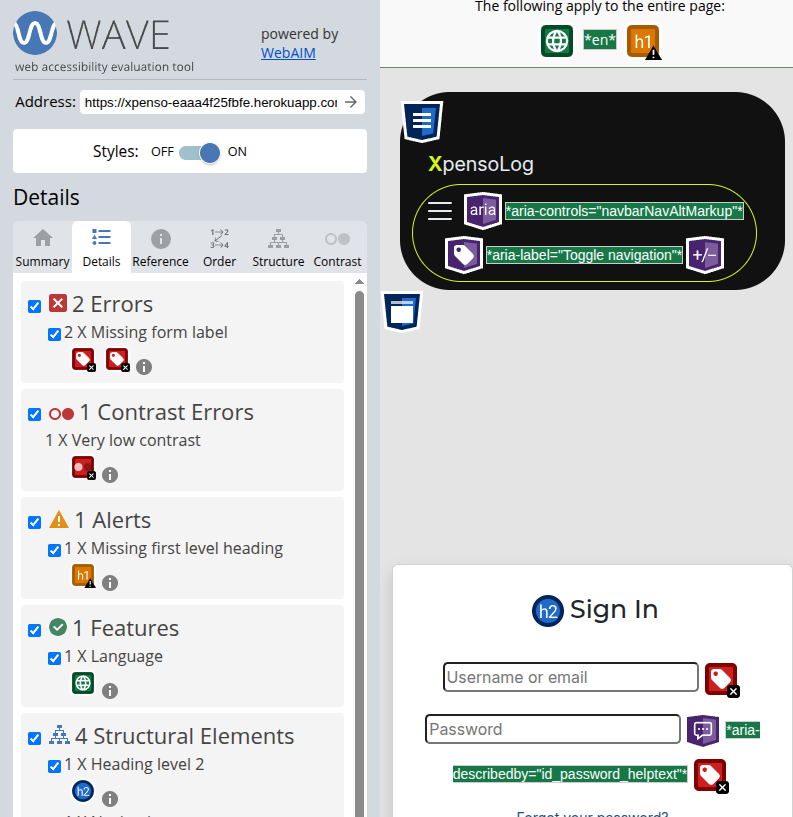

- **How I fixed it:**  
login.html: Added label elements with related IDs above username and password fields and changed heading level on Sign Up.  
base.html: Changed text to white by removing the 'text-muted' class.

- **Final result:** Passed  
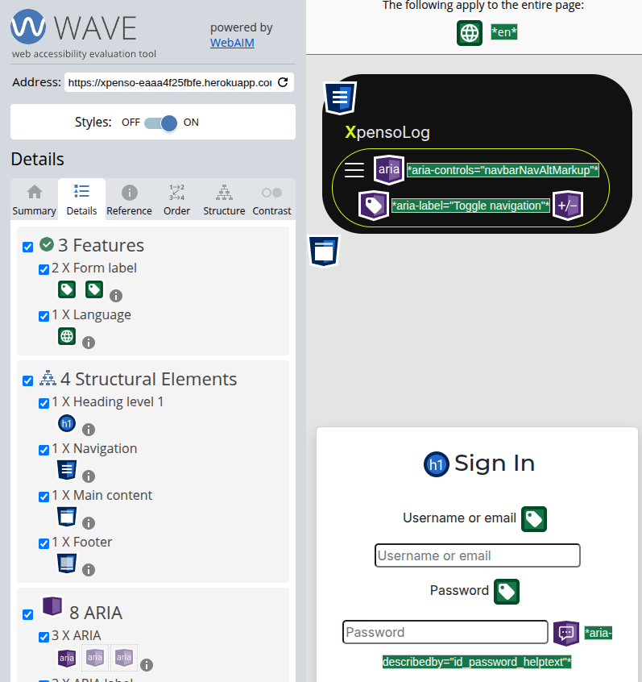

<strong>signup.html</strong>

- **Result:** Initial run failed  
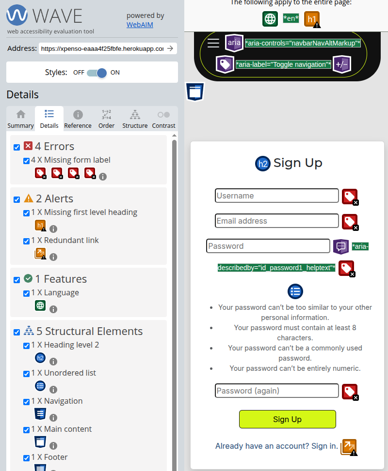

- **How I fixed it:**  
    - Added labels to HTML template.
    - Changed heading level.
    - The link is not redundant; it is needed for user flow, so the alert was not addressed.

- **Final result:** Passed  
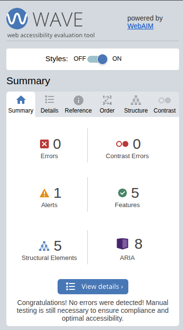

<strong>password_reset.html</strong>

- **Result:** Passed  
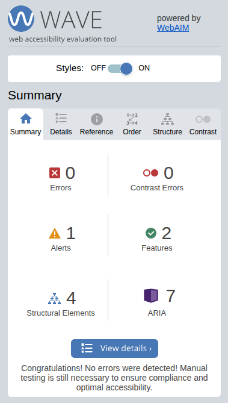

<strong>password_reset_done.html</strong>

- **Result:** Passed  
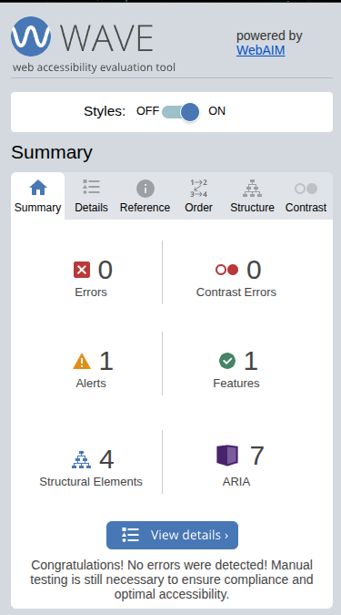

<strong>password_reset_from_key.html</strong>

**Result:** Initial run failed
 

- **Result:** Passed  
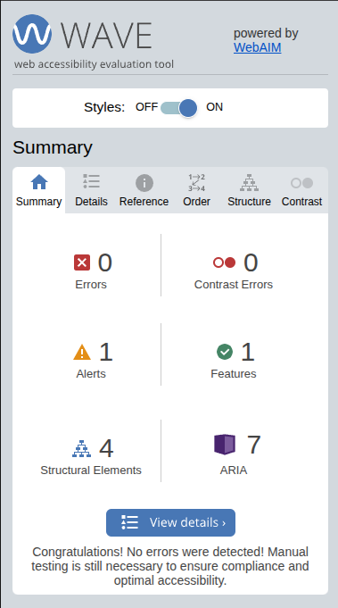

<strong>password_reset_done.html</strong>

- **Result:** Passed  

<strong>verify_email_required.html</strong>

- **Result:** Passed  
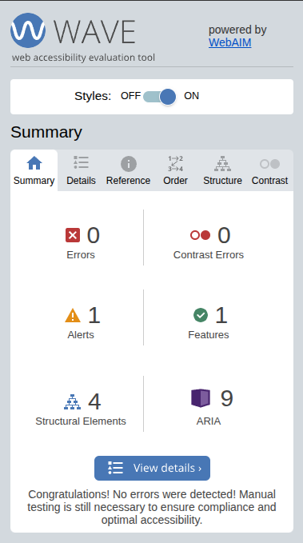

<strong>email_confirm.html</strong>

- **Result:** Passed  
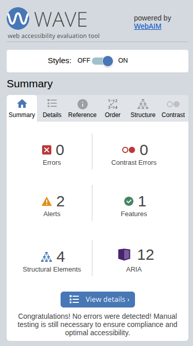

<strong>dashboard.html</strong>

- **Result:** Passed  
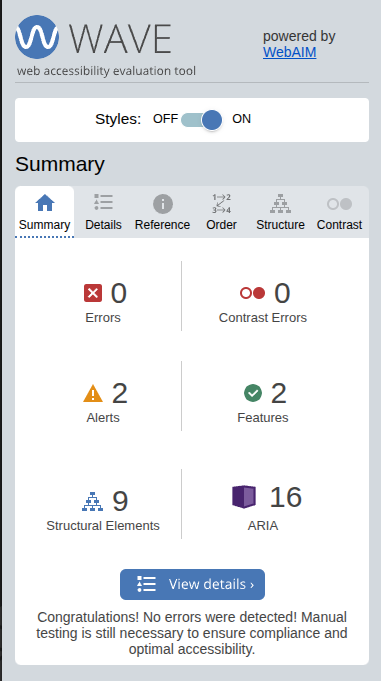

- **Alerts:**
    - During the accessibility test for the dashboard, an alert for a skipped heading was apparent. However, after investigation, the error was not visible on the page. Because there was no visual indication of the error and it also did not affect the page, this was not addressed.

- **Alert:** Unknown  
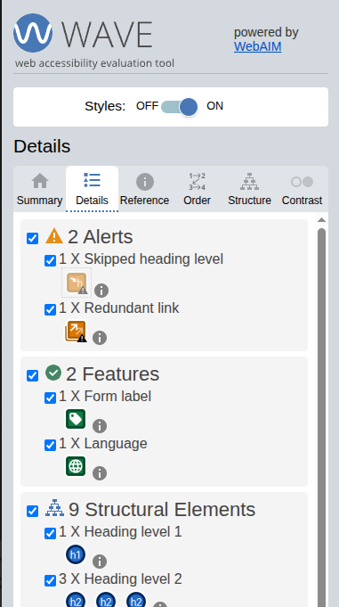

<strong>budget_form.html</strong>

- **Result:** Passed  
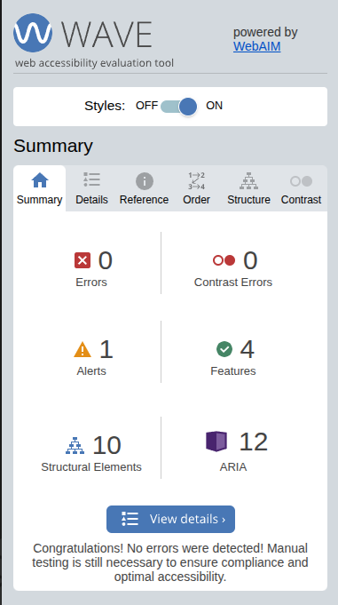

<strong>expense_form.html</strong>

- **Result:** Passed  
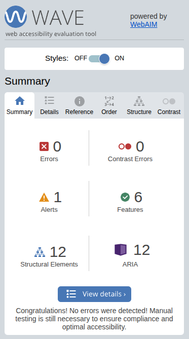

<strong>income_form.html</strong>

- **Result:** Passed  

<strong>profile.html</strong>

- **Result:** Passed  
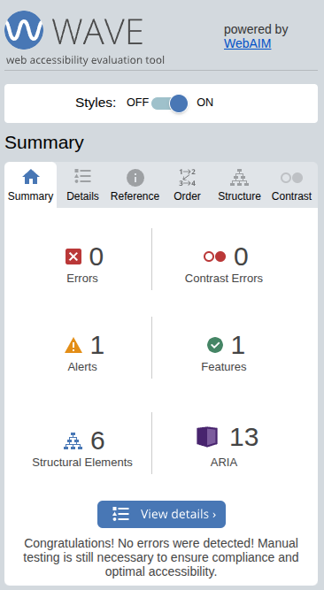

<strong>email.html</strong>

- **Result:** Passed  
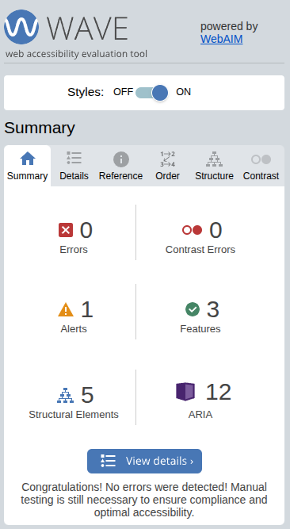

<strong>password_change.html</strong>

- **Result:** Passed  
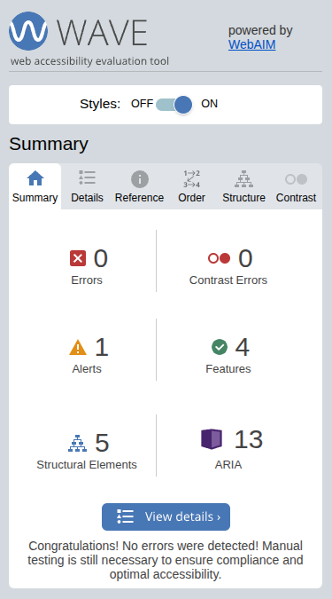

<strong>delete_user.html</strong>

- **Result:** Passed  
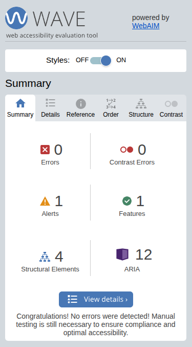

<strong>logout.html</strong>

- **Result:** Passed  
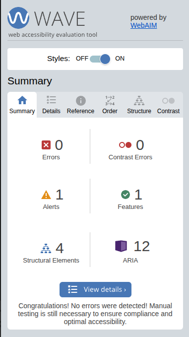

<strong>404.html</strong>

- **Result:** Passed  
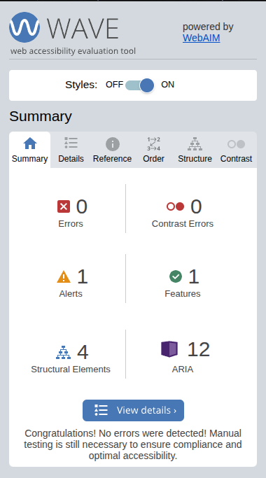

