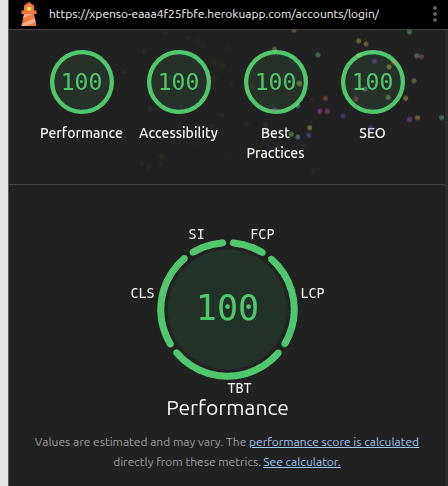

# Lighthouse Testing

Lighthouse is an automated tool built into Chrome that audits web pages for performance, accessibility, best practices, SEO, and more. Running Lighthouse tests helps to identify areas for improvement, ensuring the site is fast, user-friendly, and accessible to all users. Each main page of Xpenso was evaluated using Lighthouse, and issues found were addressed to meet high standards.

---

<strong>login.html</strong>

- **Result:** 

