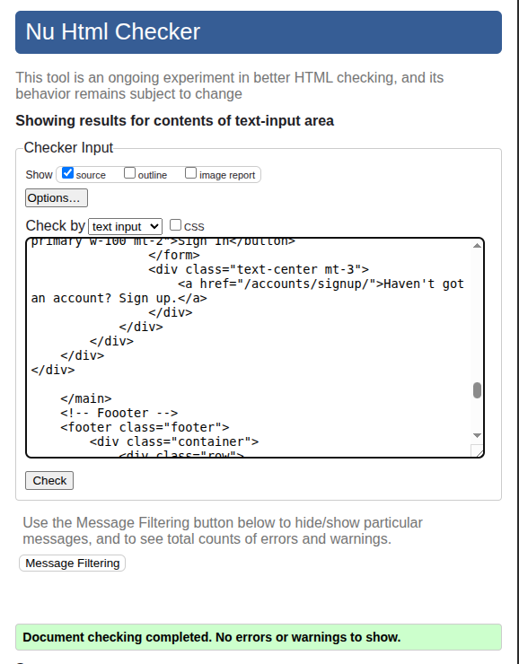
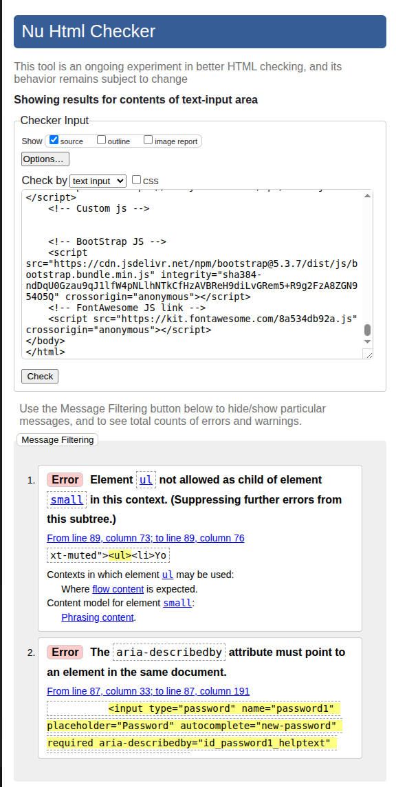
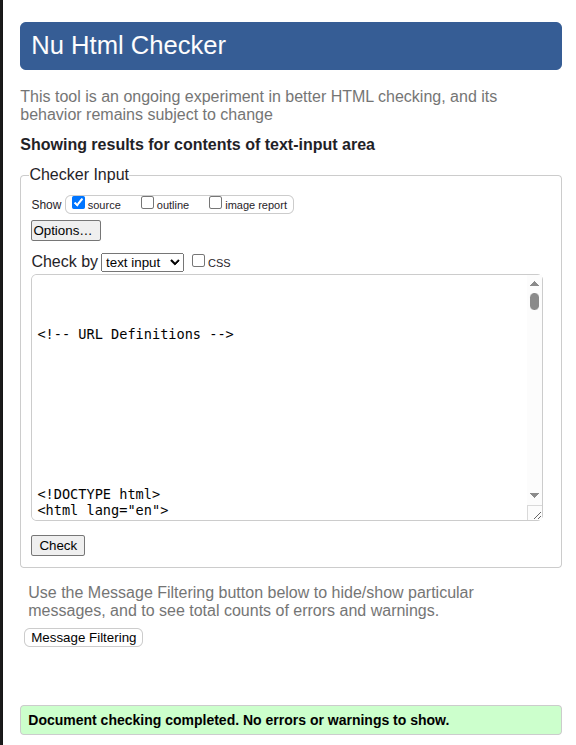
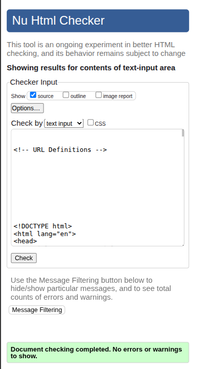
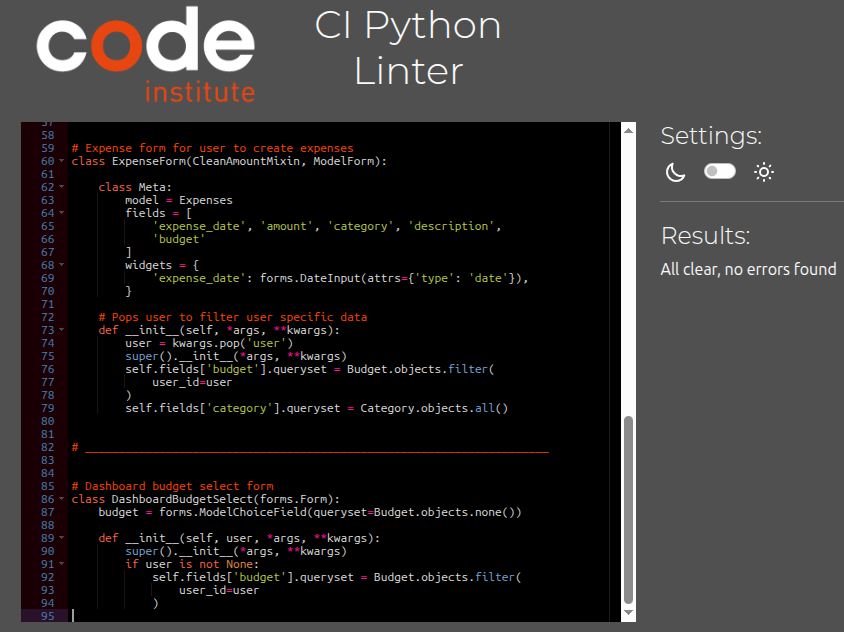

## Code Validation

### HTML  

All HTML files were validated using the [W3C Markup Validation Service](https://validator.w3.org/).

<strong>login.html</strong>

- **Result:** Passed

<strong>signup.html</strong>

- **Result:** Initial run failed  

- **How I fixed it:**  
Added ID to respective password helper and then replaced the password helper small element with a div.

- **Final result:** Passed  

<strong>Verified_email_required.html</strong>

- **Result:** Passed

<strong>dashboard.html</strong>

- **Result:** Initial run failed  

- **How I fixed it:**  
    - Closed open ul.
    - Closed div
    - removed stray p element
    - Changed capital P to lowercase p on element

- **Final result:** Passed  

<strong>budget_form.html</strong>

- **Result:** Passed

<strong>expense_form.html</strong>

- **Result:** Passed

<strong>income_form.html</strong>

- **Result:** Passed

<strong>profile.html</strong>

- **Result:** Passed

<strong>email.html</strong>

- **Result:** Passed

<strong>password_change.html</strong>

- **Result:** Initial run failed  

- **How I fixed it:**  
    - id_password1_helptext ID missing a related element. Added if satement for password helper
    and added the missing ID.

- **Final result:** Passed  

<strong>password_reset.html</strong>

- **Result:** Initial run failed  

<strong>password_reset_done.html</strong>

- **Result:** Initial run failed  

<strong>password_reset_from_key.html</strong>

- **Result:** Initial run failed

- **How I fixed it:**  
    - Initially this page had an issue of no aria-describedby error when testing for validation. This led me on a 4 hour battle attempting multiple fixes such as Rendering form.password as a widget only, adding the help_text id to different elements and removing the DTL template tag and replacing with raw html input. Nothing seemed to work. But The solution was right in front of me all along. I truly felt the fog of war (frustration) blinded my mind to think clearly. Each time I pushed, the page source wouldn't update to my template changes. I tried resetting the Heroku dyno, attempting to clear any and every cache, but to no avail. I then turn off my PC and rebooted it and started up Firefox Dev, instead of Chrome, I opened Dev tools and seen the deployed site code was indeed updated... Ureeka!. 

         I then went back to Chrome and pulled up the source code on the same page, and it was completely different. I then realized that the issue was that I had to clear the cache in Chrome. After clearing the cache, the aria-describedby error was gone and the page passed html validation. I felt like I wasted so much time on such a simple fix, but I don't believe any time is wasted when you learn something new.

- **Final result:** Passed

<strong>password_reset_from_key_done.html</strong>

- **Result:** Passed

<strong>delete_user.html</strong>

- **Result:** Passed

<strong>logout.html</strong>

- **Result:** Passed

<strong>404.html</strong>

- **Result:** Passed

---

### CSS 

All CSS files were validated using the [W3C CSS Validation Service](https://jigsaw.w3.org/css-validator/).

<strong>style.css</strong>

- **Result:** Passed  

---

### JavaScript

All JavaScript files were checked using [JSHint](https://jshint.com/).

<strong>main.js</strong>

- **Result:** Passed with warning shown

- **Warning:**  
JS Hint presented a warning, however the warning is irrelevant, since 'new' is needed for chart.js, therefore ignored warning.

---

### Python

All Python files were checked using [Code Institute's Python Linter (PEP8CI)](https://pep8ci.herokuapp.com/).

 #### Finances App - Python Files

<strong>finances/views.py</strong>

- **Result:** Passed  

<strong>finances/urls.py</strong>

- **Result:** Passed 

<strong>finances/tests.py</strong>

- **Result:** Passed 

<strong>finances/models.py</strong>

- **Result:** Passed 

<strong>finances/forms.py</strong>

- **Result:** Passed 

<strong>finances/apps.py</strong>

- **Result:** Passed 

<strong>finances/admin.py</strong>

- **Result:** Passed 

#### Let's Talk Money Project - Python Files

<strong>letstalkmoney/urls.py</strong>

- **Result:** Passed 

