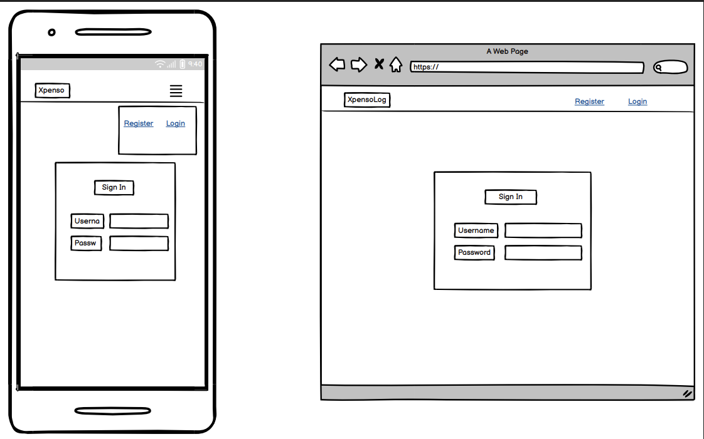
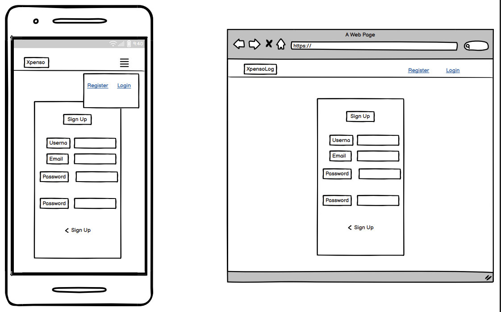
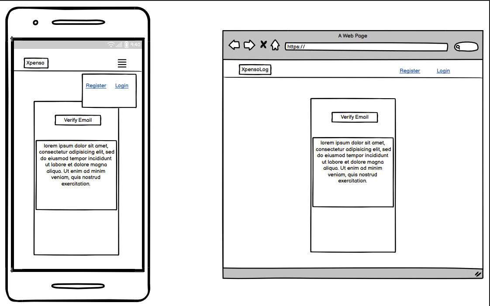
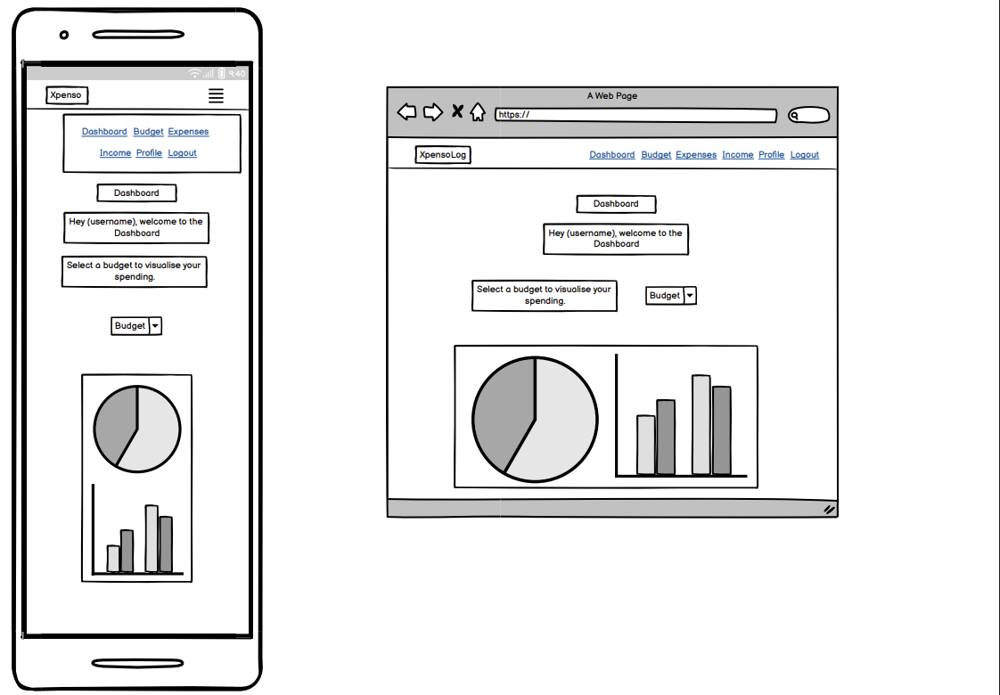
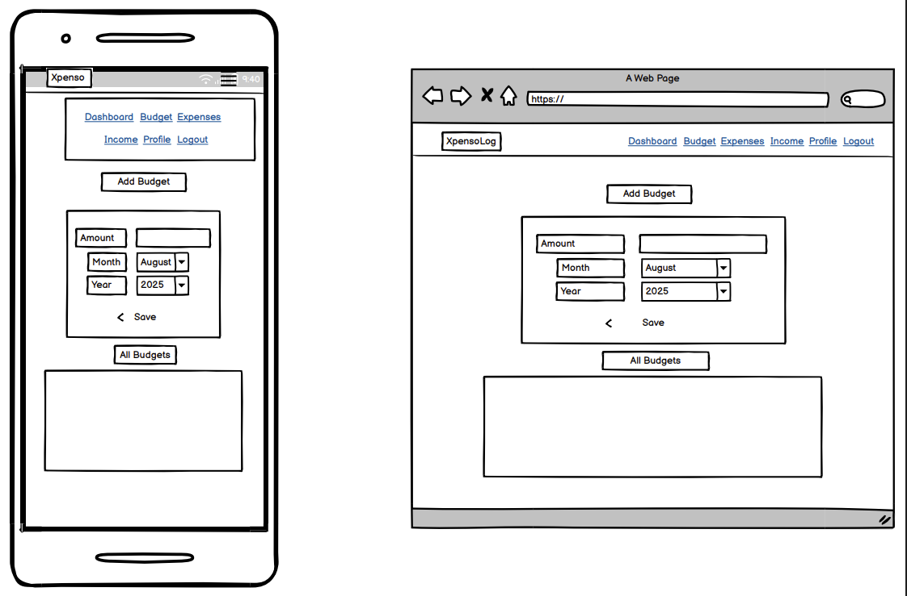
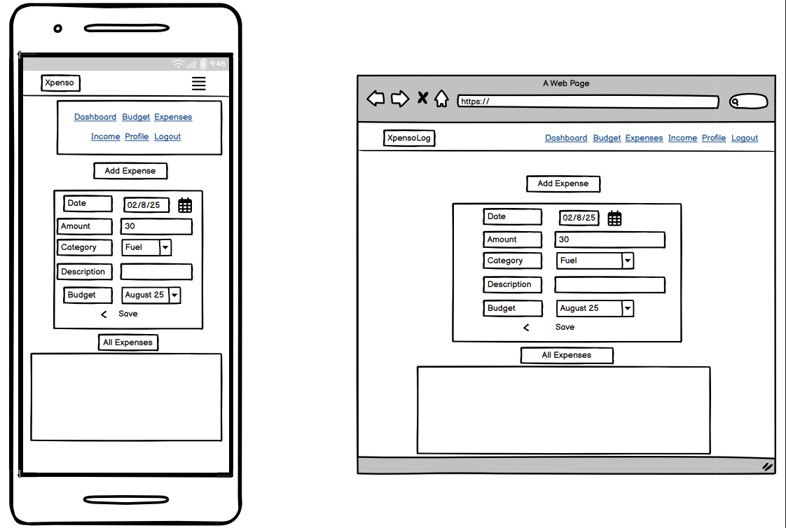
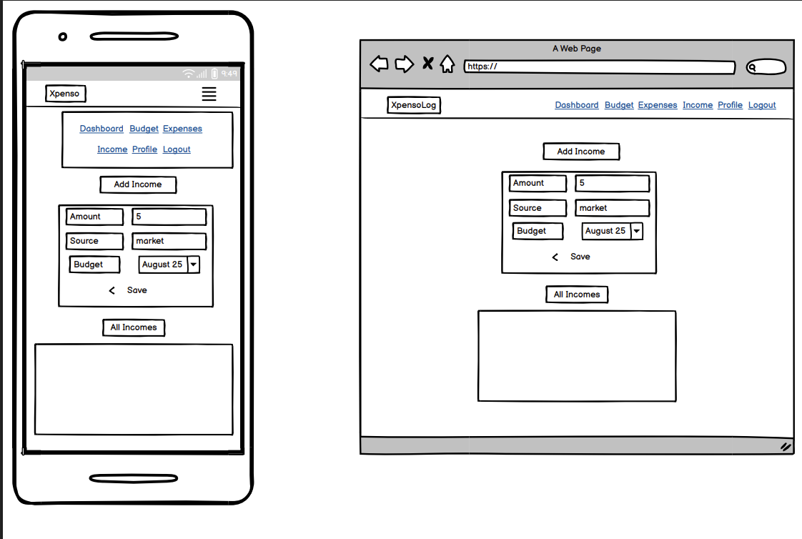
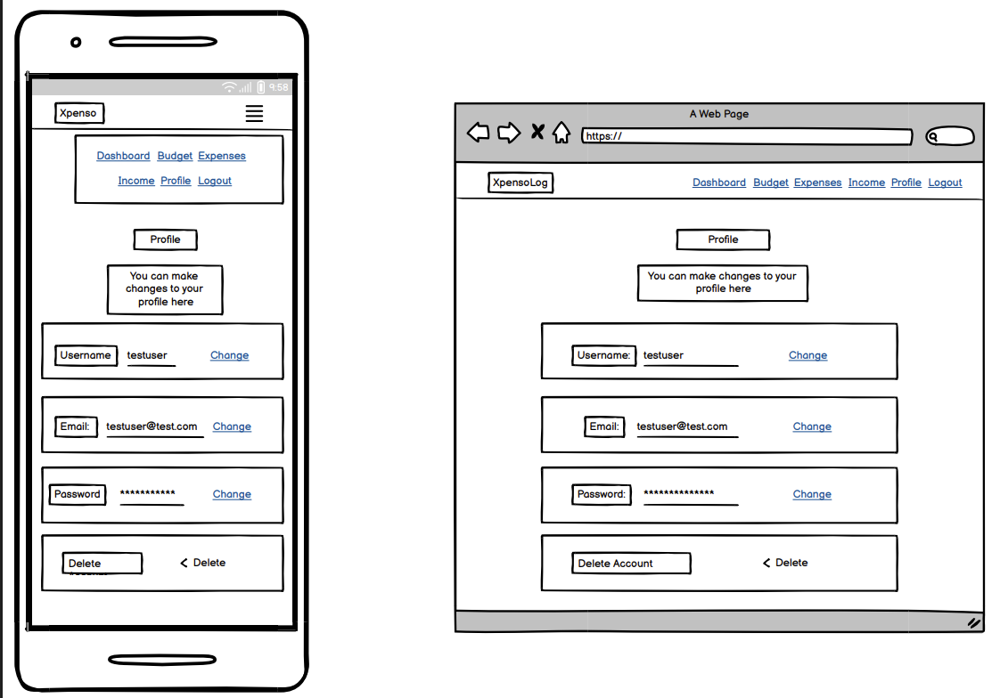
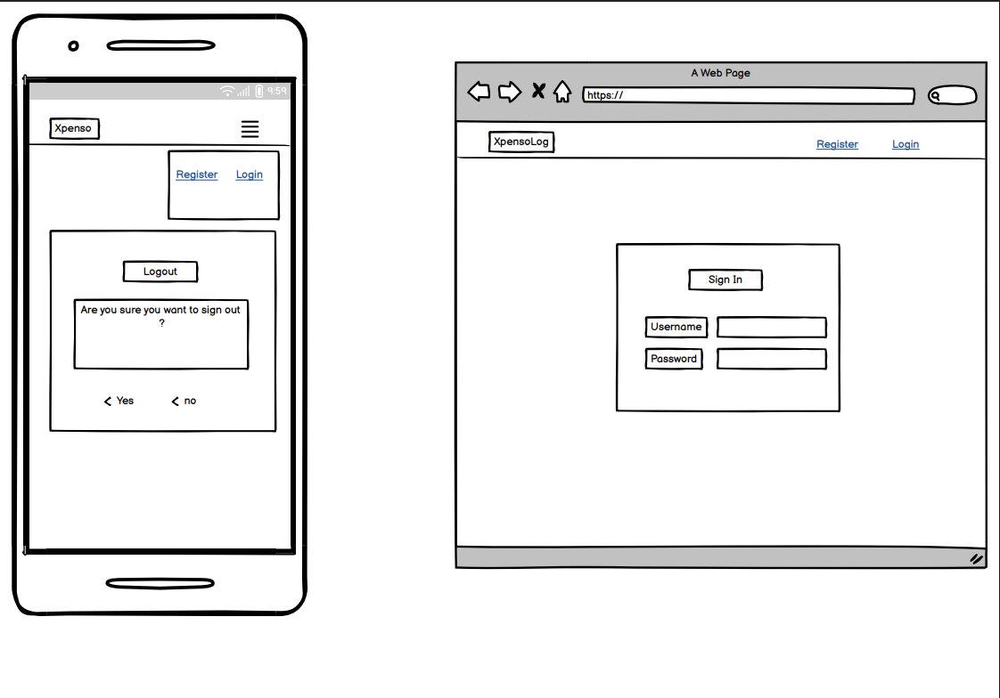

# Wireframes

This document presents the wireframes created for each main page in the Xpenso app. Wireframes are simple sketches or outlines used during the planning stage to visualise the layout and basic features of each page before development began.
It’s likely the final product may differ from what is displayed in these sketches.

---

<strong>signin</strong>

- Simple page for users to enter their email and password to access Xpenso.

<strong>signup</strong>

- Allows new users to create an account by providing basic details.

<strong>verify-email</strong>

- Page shown after signup, prompting users to verify their email via a link.

<strong>dashboard</strong>

- The main user dashboard with an overview of budgets, income, and expenses.

<strong>budget</strong>

- Page for viewing and managing monthly or custom budgets.

<strong>expenses</strong>

- A dedicated area for tracking and adding expense entries.

<strong>income</strong>

- Page for recording and viewing sources of income.

<strong>profile</strong>

- User profile information and settings page.

<strong>logout</strong>

- Simple confirmation page for logging out of Xpenso.

